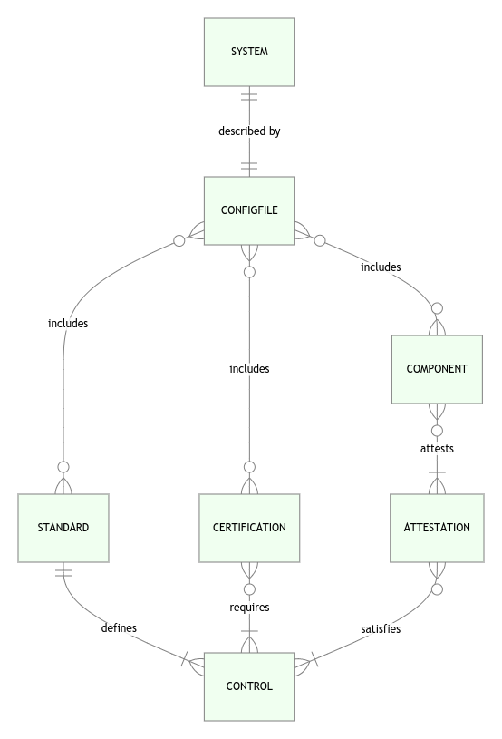

# OCTool

<!--TOC-->

- [Overview](#overview)
- [How-to](#how-to)
  - [Get started with an example](#get-started-with-an-example)
    - [The easy way](#the-easy-way)
      - [Pull an already-built Docker image](#pull-an-already-built-docker-image)
      - [Generate an SSP from the example data with Docker](#generate-an-ssp-from-the-example-data-with-docker)
    - [Roll-your-own deployment](#roll-your-own-deployment)
      - [Prereqs](#prereqs)
      - [Install OCTool](#install-octool)
      - [Generate an SSP from the example data with your own deployment](#generate-an-ssp-from-the-example-data-with-your-own-deployment)
  - [Write your own data files](#write-your-own-data-files)
  - [Pandoc filters](#pandoc-filters)
  - [Build and test](#build-and-test)
- [Concepts](#concepts)
  - [Entities](#entities)
  - [System vs component](#system-vs-component)
  - [Benefits](#benefits)
- [Administrivia](#administrivia)
  - [Goals](#goals)

<!--TOC-->

## Overview

OCTool aspires to be an open compliance tool and library.

It uses Pandoc, TeXLive, LuaTeX, and an open data schema to
produce compliance documents, such as System Security Plans (SSPs).

This repo provides:

- Ruby gem: https://rubygems.org/gems/octool
- Docker image: https://hub.docker.com/repository/docker/jumanjiman/octool


## How-to

### Get started with an example

This repo provides an example tree at `example-inputs/minimal`.


#### The easy way

##### Pull an already-built Docker image

```bash
docker pull jumanjiman/octool
```

##### Generate an SSP from the example data with Docker

```bash
docker run --rm -it -v /tmp:/data jumanjiman/octool ssp /example-inputs/minimal
```

The above command builds the SSP and
saves it at `/tmp/ssp.pdf` on your Docker host.


#### Roll-your-own deployment

##### Prereqs

Your host needs these packages:

- Ruby 2.4+
- Pandoc 2.9+
- Python 3.6+
- TexLive full distribution, including LuaTeX and XeLaTeX


##### Install OCTool

```bash
gem install --user-install octool
```

##### Generate an SSP from the example data with your own deployment

1. Confirm the example data is valid

    ```bash
    octool validate example-inputs/minimal/config.yaml
    ```

1. Build a PDF

    ```bash
    octool ssp example-inputs/minimal/config.yaml
    ```

1. The result should look like the example output at
   [example-outputs/minimal/ssp.pdf](example-outputs/minimal/ssp.pdf).


### Write your own data files

The schemas are at [src/schemas/](src/schemas).<br/>
Things to know:

- All text strings are interpreted as markdown.<br/>
  You can use markdown in your data anywhere a string is required.<br/>
  See [example-inputs/minimal](example-inputs/minimal) for demo data.

  :bulb: Pandoc has its own flavor of markdown.<br/>
  See https://pandoc.org/MANUAL.html#pandocs-markdown<br/>
  for differences from other flavors.

  :bulb: When you reference paths to images within your markdown, the<br/>
  path is relative to the directory in which `config.yaml` is stored.<br/>
  See the example-inputs files for clarity.

- You can run `octool validate path/to/inputs`<br/>
  to confirm your data structure.

- Do you want to run `octool` in a read-only container?<br/>
  TeX needs to write to at least one directory.<br/>
  Make at least one of these a volume in your container:

  - `${HOME}` (inconvenient for unprivileged user with read-only homedir)
  - `/usr/share/texmf-var` (writable only by root)

  The Docker image in this repo works around the issue to<br/>
  enable read-only containers.


### Pandoc filters

OCTool builds in support for these Pandoc filters via the schema:

- https://gitlab.com/mirkoboehm/pandoc-acronyms


### Build and test

This repo builds, tests, and publishes a Docker image that includes the
full TeXLive distribution and OCTool. The test harness runs the container
with a **read-only** root filesystem and **reduced privileges** to demonstrate
good security practices for containerized applications.

```bash
# Setup your dev environment.
sdlc/bootstrap

# Build and test.
sdlc/build && sdlc/test
```


## Concepts

### Entities

This diagram helps to illustrate the definitions that follow.<br/>
It reads top-down and left-to-right.



- **System**: A potentially-complex technology architecture that
  includes one or more components.

- **ConfigFile**: An OCTool configuration file.

- **Component**: A list of components within the system along with
  attestations to satisfy one or more controls.

- **Standard**: A list that defines one or more security controls.

    An example of a standard is NIST 800-53 or Payment
    Card Industry Data Security Standards (PCI DSS).

- **Control**: A specific requirement or process to describe and mitigate risk.

- **Certification**: A list that requires one or more controls.

    A certification requires all or a subset of controls
    from one or more standards.<br/>
    A hypothetical certification could include
    all of NIST 800-53 _plus_ a specific subset of PCI DSS.

    An Authority to Operate (ATO) is one example of a certification.
    A request list from an auditor is another example.


### System vs component

A component and a system can be identical from a compliance perspective
in the simplest cases. It is common, however, that a complex system
delegates compliance to multiple responsible parties
along organizational boundaries in a _shared services_ model.

Consider, for example, an organization that owns its datacenter and
assigns responsibility for physical access to a dedicated team.

- The organization can describe the datacenter as a component and
  describe its compliance to physical access controls
  within a shareable component called _datacenter_.

- Teams that operate software within the datacenter can then
  include the _datacenter_ component
  within their own compliance documentation.

With the shared services model, the _system_ compliance documentation
_includes_ various components. Its compliance documentation is
assembled from various components.

Thus some systems are described by multiple components;
smaller systems, by a single component.


### Benefits

- If an application owner requests an exception to a control from a
  shared component, the InfoSec team can run an impact assessment
  to see which other applications (systems) and/or certifications
  would be impacted by the exception.

- The organization can use the system to ask what-if questions.

- Compliance and regulatory teams have a central source of truth
  from which to answer questions.

- Git provides an audit log of changes to the compliance docs.

- The intermediate output (SQL database, CSV, etc.) is available
  so teams can choose whatever analytical tools they prefer.


## Administrivia

### Goals

- [X] Read input configuration in multiple formats
- [X] Generate output documentation for governance and compliance
  - [ ] Excel
  - [X] Markdown
  - [X] PDF
  - [X] Word
- [X] Convert inputs to a well-defined data structure
  - Intermediate output
    - [X] CSV
    - [ ] Excel
    - [ ] SQLite
  - Facilitate gap analysis
  - Facilitate impact analysis for exceptions
